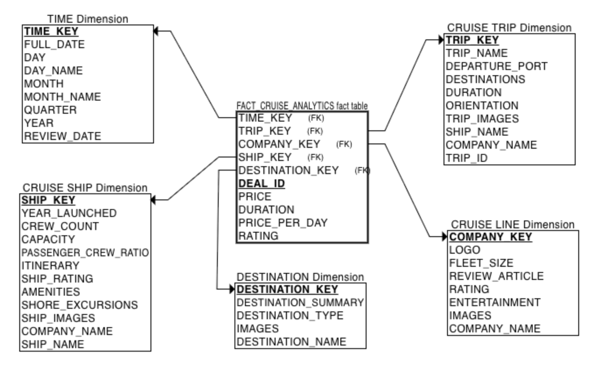
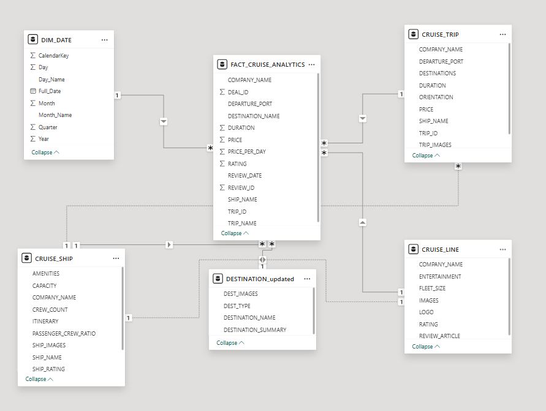
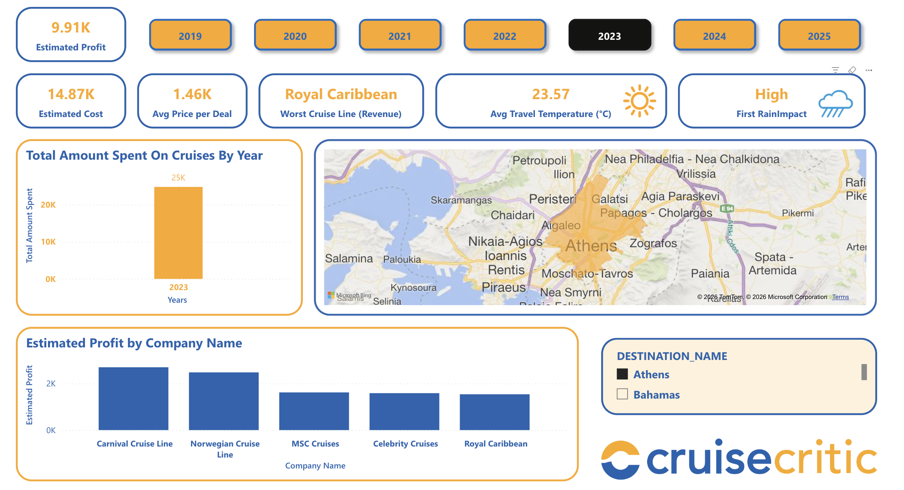
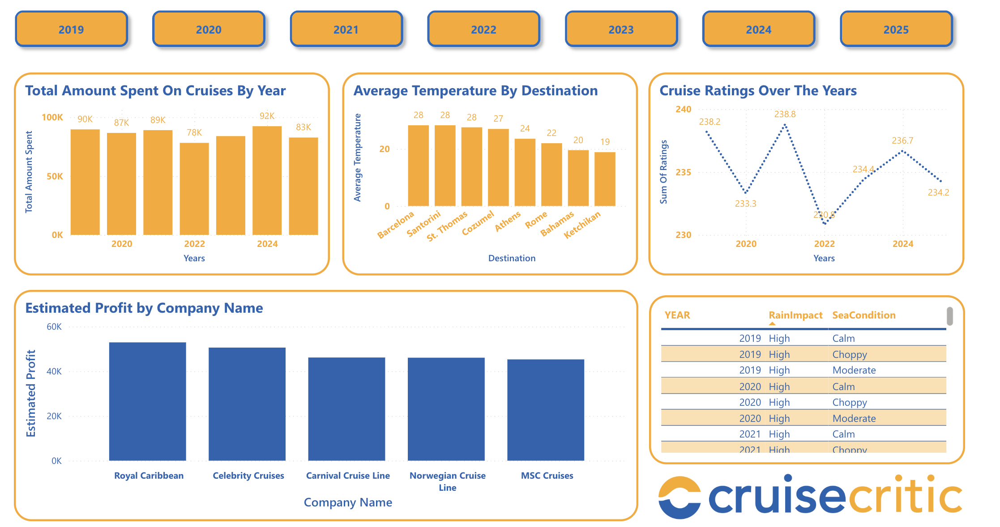

# Cruise Critic Database & Analytics Project

**Collaborators: Abrar Jawad Tarafder, Ekambir Momi, Shoumik Ahmed**

## Overview
This project is based on a completed **EECS 3421 – Database Systems** group project that designed and implemented a relational database for a simplified **Cruise Critic** cruise booking and review platform.  

As an extension beyond the course requirements, a **Power BI analytics layer** was added to transform the transactional database into an analytical decision-support system.

---

## Original Database Project (EECS 3421)

### Objective
Design and implement a relational database to support core Cruise Critic functionality, including cruise search, deals, reviews, destinations, and community interaction.

### Technologies
- Microsoft SQL Server  
- Azure Data Studio  
- ERDPlus  

### Key Features
- Fully normalized relational schema  
- Primary and foreign key constraints  
- Referential and domain integrity enforcement  
- Sample data populated across all tables  
- Management-focused SQL queries (pricing, ratings, demand)

### Core Tables
- CRUISE_LINE  
- CRUISE_SHIP  
- CRUISE_TRIP  
- CRUISE_DEAL  
- DESTINATION  
- PORT  
- COMMUNITY_REVIEW  
- USER_ACCOUNT  
- FORUM  

---

## Power BI Analytics Extension

### Purpose
The Power BI extension adds an analytical layer on top of the relational database to support business insights and OLAP-style analysis.

### Tools
- Power BI 
- SQL  
- DAX
- Database Markup Language

### Data Model
- **Fact Table:** FACT_CRUISE_ANALYTICS  
- **Dimensions:** Cruise Line, Cruise Trip, Destination, Cruise Ship, Date  

**Grain:** One row per cruise deal per trip.

The STAR schema is shown below:
(Note the surrogate keys for each DIMENSION table and the FACT table)

The PowerBI Dashboard metrics are created based on the STAR Schema.

### Power BI Data Model Implementation
The analytical model follows a star schema design using the surrogate keys conceptually for all dimensions. In the Power BI implementation, stable natural keys (Trip ID, Company Name, Ship Name, Destination Name, and Review Date) are used directly to define relationships between the fact and dimension tables. This approach is sufficient given the dataset's static nature and avoids unnecessary ETL complexity while preserving the integrity of the star schema.

- `FACT_CRUISE_ANALYTICS[REVIEW_DATE]`
  → `DIM_DATE[Full_Date]`

- `FACT_CRUISE_ANALYTICS[TRIP_ID]`
  → `DIM_CRUISE_TRIP[TRIP_ID]`

- `FACT_CRUISE_ANALYTICS[COMPANY_NAME]`
  → `DIM_CRUISE_LINE[COMPANY_NAME]`

- `FACT_CRUISE_ANALYTICS[SHIP_NAME]`
  → `DIM_CRUISE_SHIP[SHIP_NAME]`

- `FACT_CRUISE_ANALYTICS[DESTINATION_NAME]`
  → `DIM_DESTINATION[DESTINATION_NAME]`

All relationships are configured as **many-to-one**, with **single-direction filtering** from dimensions to the fact table.

## Dashboard 1
The first dashboard enables analysis of:
- Estimated Profit (approximated as 40% of Total Revenue).
- Total Revenue (Amount Spent) by Year (trend across 2019–2025).
- Estimated Cost (approximated as 60% of Total Revenue).
- Top Cruise Line (Cruise Line with the Highest Revenue).
- Total Deals by Year.
- Average Price Per Deal.
- Worst Cruise Line (Cruise Line with the Lowest Revenue).
- Estimated Profit by Cruise Line (comparison across companies).
- Estimated Profit by Trip Duration.
- Destination Overview (map visualization highlighting the most visited destination and enabling destination-based filtering).
- Most Visited Destination.

## Dashboard 2

The second dashboard focuses on destination-level and contextual insights, allowing users to explore cruise performance alongside environmental and location-based factors. It highlights how revenue, profitability, and demand change across destinations and over time.

This dashboard enables analysis of:
- Estimated Profit (approximated as 40% of Total Revenue).
- Estimated Cost (approximated as 60% of Total Revenue).
- Total Amount Spent on Cruises by Year (2019–2025).
- Year Slicer
- Average Price per Deal.
- Best and Worst Cruise Lines by Revenue.
- Estimated Profit by Cruise Line.
- Average Travel Temperature (°C) by destination and year.
- Weather Impact indicator (Rain Impact classification).
- Destination overview using an interactive map visualization.
- Destination-based filtering that dynamically updates all KPIs and visuals.

Dashboard 2 complements Dashboard 1 by shifting the focus from overall financial trends to destination-aware analysis, helping users understand how location, climate conditions, and seasonal factors intersect with cruise demand and profitability.

## Dashboard 3

The third dashboard provides a deeper analytical view of cruise performance by integrating financial trends, destination characteristics, customer ratings, and environmental conditions. It is designed to support multi-dimensional analysis across time, cruise lines, and destinations.

This dashboard enables analysis of:
- Total Amount Spent on Cruises by Year (2019–2025) to evaluate long-term revenue patterns.
- Average Temperature by Destination to analyze destination seasonality and climate influence.
- Cruise Ratings Over the Years to track changes in customer satisfaction over time.
- Estimated Profit by Cruise Line for comparative profitability analysis.
- Table of Environmental Conditions by Year, including Rain Impact and Sea Condition classifications.
- Year-based filtering to isolate specific periods for focused analysis.
- Interactive cross-filtering across all visuals to explore relationships between spending, destination climate, environmental factors, and customer ratings.

Dashboard 3 complements Dashboards 1 and 2 by extending the analysis beyond core financial KPIs into customer experience and environmental context, enabling more nuanced insights into factors influencing cruise demand and performance.

